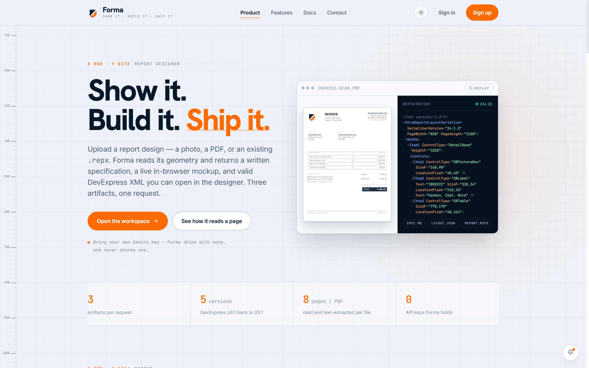
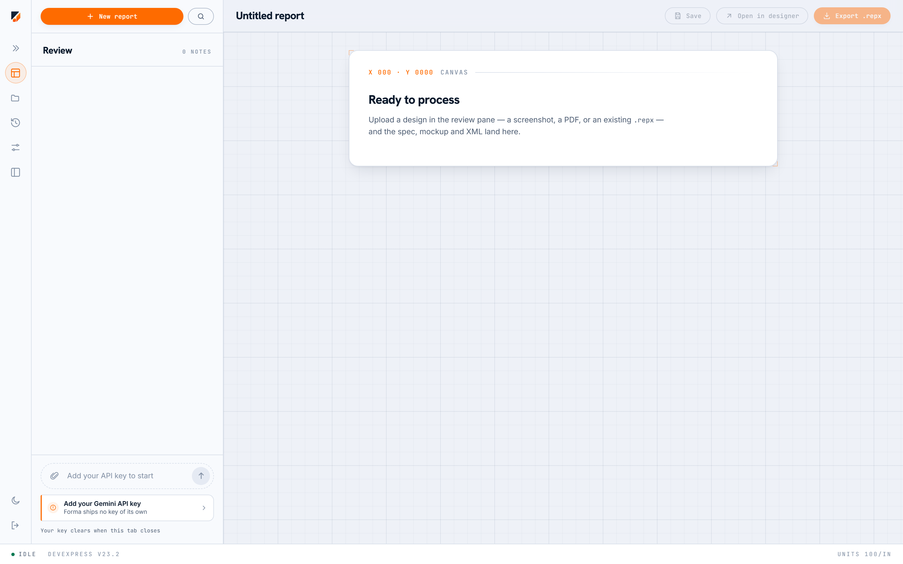

# Forma

Turn a screenshot, a PDF, or an existing report into a real DevExpress `.repx` file.

[](LICENSE)
[](#prerequisites)
[](tsconfig.json)
[](package.json)
[](package.json)

<!-- TODO: add a build-status badge once this repository has a remote. The workflow
     exists at .github/workflows/checks.yml but has never run, because there is no
     remote to run it on. The badge URL needs the real owner/name:
     [](../../actions) -->

Upload a design — a mockup, a scanned invoice, a photo of a printout, or a `.repx` you already have — and Forma returns three things in one pass:

- a **markdown specification** of the layout,
- an **in-browser mockup** drawn from a structured layout description, so you can see what it understood before you download anything,
- **`repxContent`** — valid `XtraReportsLayoutSerializer` XML that saves as a `.repx` and opens directly in the DevExpress Report Designer.

---

## Why this exists

Rebuilding an existing report in the DevExpress designer is mechanical work: read the layout, place the bands, set the units, repeat. Forma does the transcription pass so you start from a `.repx` that already has the right control types and geometry, and spend your time on the parts that need judgement.

It is built around one constraint that shaped everything else: **the application owns no API key.** An earlier build inlined a build-time Gemini key into the shipped JavaScript, and Google's secret scanner found and revoked it. What replaced it is not a patch but an architecture — the browser calls Google directly with a key the user supplies, and no server is ever in the loop.

---

## Demo



The workspace itself — the uploaded design and the conversation on the left, the rendered mockup on the right, and the `Mockup` / `Spec` / `REPX` tabs over the three artifacts:



Both are real captures of the app at `localhost:3000`, not mockups. See [`docs/media/README.md`](docs/media/README.md) for how they were taken.

---

## Table of contents

- [Why this exists](#why-this-exists)
- [Bring your own key](#bring-your-own-key)
- [Features](#features)
- [Tech stack](#tech-stack)
- [Getting started](#getting-started)
  - [Prerequisites](#prerequisites)
  - [Installation](#installation)
  - [Environment variables](#environment-variables)
  - [Running locally](#running-locally)
- [Usage](#usage)
- [Using your own Firebase project](#using-your-own-firebase-project)
- [Configuration](#configuration)
- [Project structure](#project-structure)
- [Scripts](#scripts)
- [Testing](#testing)
- [Deployment](#deployment)
- [Roadmap](#roadmap)
- [Status and limitations](#status-and-limitations)
- [Contributing](#contributing)
- [License](#license)
- [Acknowledgements and contact](#acknowledgements-and-contact)

---

## Bring your own key

**Forma ships no Gemini API key, and it never will.** Every user supplies their own, and the browser calls Google directly with it — the server is never in the loop and never sees a credential.

This is not an accident of design. An earlier build inlined a build-time key into the shipped JavaScript; Google's secret scanner found it and revoked it. The architecture that replaced it is deliberate:

| Where the key lives | Lifetime |
|---|---|
| `sessionStorage` | Erased by the browser when the tab closes |
| Firestore (opt-in, signed in) | **AES-GCM ciphertext only** |

The optional cloud copy is zero-knowledge: your key is encrypted in your browser with a passphrase derived through PBKDF2-SHA256 (310,000 iterations, per-record salt and IV). The passphrase never leaves your machine, so nobody operating a Forma deployment can read your key.

That also means **a forgotten passphrase is unrecoverable by design.** There is no reset, because a reset would imply the operator could decrypt it.

The claim is enforced, not just intended: the server sends a Content-Security-Policy whose `connect-src` allowlists the handful of origins this app legitimately talks to. A key sitting in `sessionStorage` a few components away from model-generated markdown is worth stealing, and `connect-src` is what makes a stolen one useless — injected script that cannot reach an attacker's server cannot exfiltrate anything. Adding an origin to that list is a change to this guarantee; see [`src/server/securityHeaders.ts`](src/server/securityHeaders.ts), which carries the full reasoning.

---

## Features

Each of these is a shipped code path, not a plan.

- **Image, PDF and `.repx` intake.** Drop a mockup, a scan, a photo, or an existing report. PDFs are rasterised *and* have their text layer extracted, so exact strings survive rather than being read back out of pixels ([`src/App.tsx`](src/App.tsx), [`src/lib/pdf.ts`](src/lib/pdf.ts)).
- **Three artifacts in one structured response** — spec, `layout`, and `repxContent` — guaranteed parseable by a Gemini `responseSchema` rather than by hoping the model returns valid JSON ([`src/services/geminiService.ts`](src/services/geminiService.ts)).
- **In-browser mockup** drawn from the `layout` JSON, so you can see what the model understood before downloading anything.
- **Runtime model detection.** Models are probed against a preference list on first use and the winner is cached for the session. Nothing is hardcoded, because Google retires models "for new users" — a pinned id keeps working for existing projects and 404s for every new key (`resolveModel` in [`src/services/geminiService.ts`](src/services/geminiService.ts), covered by `modelResolution.test.ts` beside it, with the curated preference list in [`src/lib/modelCatalog.ts`](src/lib/modelCatalog.ts)).
- **Streaming progress with pause and stop.** Once the model starts writing, the progress bar and character count reflect output actually received ([`src/lib/generationProgress.ts`](src/lib/generationProgress.ts)).
- **Optional sign-in and cloud sync.** Signed out, Forma saves to `localStorage` and works fully; signed in, reports sync to Firestore under rules that enforce account isolation ([`firestore.rules`](firestore.rules)).
- **Zero-knowledge key vault.** AES-GCM encryption in the browser, PBKDF2-SHA256 key derivation ([`src/services/keyVault.ts`](src/services/keyVault.ts)).
- **Account deletion that actually deletes**, removing both saved reports and the encrypted key — proven by a test running against the emulator with production rules enforced ([`tests/accountDeletion.test.ts`](tests/accountDeletion.test.ts)).
- **A single place for unit conversion.** Four coordinate systems meet in this pipeline and every conversion between them lives in one module, because a mismatch renders a plausible layout in the wrong place and never throws ([`src/lib/reportGeometry.ts`](src/lib/reportGeometry.ts)).
- **Optional Windows companion** that opens a generated `.repx` in the real DevExpress designer over a loopback listener, feature-detected so the button only appears when it is running ([`tools/RepxDesigner/`](tools/RepxDesigner/), [`src/lib/designerBridge.ts`](src/lib/designerBridge.ts)).
- **Mock mode** — `VITE_FORMA_MOCK=true` returns a canned invoice after a 3s delay, for exercising loaders and progress bars without spending a request.

---

## Tech stack

| Layer | Choice |
|---|---|
| UI | React 19, Tailwind v4 (no config file — CSS-first), Motion for animation |
| Build | Vite 6, esbuild for the server bundle |
| Language | TypeScript, `strict` enabled |
| Server | Express 4 — the **same** `server.ts` in development and production |
| AI | `@google/genai`, called from the browser |
| Auth & storage | Firebase Auth + Firestore, both optional |
| Documents | `pdfjs-dist` for PDF intake, `react-markdown` + `remark-gfm` for the spec |
| Tests | Vitest, `@firebase/rules-unit-testing` against the Firestore emulator |

There is no ESLint config, no state-management library, no date library, no HTTP client (native `fetch`), and no icon package — the icons are inline SVG.

---

## Getting started

### Prerequisites

- **Node 20, 22, or 24+** (developed on Node 24.18.1 / npm 11.16.0). "20+" is the wrong shorthand: Vitest supports `^20 || ^22 || >=24`, so the odd-numbered lines **21 and 23 are outside the supported range** even though they are newer than 20.
- **A Gemini API key** from [Google AI Studio](https://aistudio.google.com/apikey) — supplied in the app at runtime, never in a file.
- **A JRE** — only for `npm run test:rules`, which starts the Firestore emulator (a JVM process). A runtime is enough; no JDK.
- **A Firebase project** — only if you want sign-in and cloud sync. Everything else works without one.

<sup>`package.json`'s `engines` field is the declaration; **three** files restate it in prose — this one, [`CONTRIBUTING.md`](CONTRIBUTING.md) and [`CLAUDE.md`](CLAUDE.md) — so raising the floor touches four files in all. (`CLAUDE.md` says "three files" and means the prose copies.)</sup>

### Installation

```bash
# TODO: replace with the real clone URL once a remote exists — this repository
# currently has none, so `git remote -v` returns nothing.
git clone <repository-url>
cd Dev_Forma

npm install
```

Contributors should use `npm ci` instead — it installs exactly what the lockfile specifies and fails if `package.json` and `package-lock.json` disagree, which is a check nothing else performs.

### Environment variables

**All three are optional, and none is a secret.** Copy [`.env.example`](.env.example) to `.env` only if you need one of them; `server.ts` loads it via `dotenv/config`.

| Name | Required | Default | Description |
|---|---|---|---|
| `VITE_FORMA_MOCK` | No | unset | Set to `"true"` to skip Gemini entirely and return a canned mock invoice after a 3s delay. Local development only. |
| `HOST` | No | loopback in dev, all interfaces in production | Which interface the server binds. Set to `0.0.0.0` only to reach the dev server from another device — that publishes Vite's module graph to anything that can reach the machine. |
| `HTTPS` | No | unset | Set to `"true"` **only where TLS actually terminates**, so the server sends HSTS. Never set it locally: a browser that receives HSTS on `http://localhost` refuses plain-HTTP localhost for a year afterwards, breaking every other project on the machine. |

> **A `GEMINI_API_KEY` in `.env` does nothing.** `vite.config.ts` allowlists `VITE_*` only, so it reaches neither the server nor the browser. It just sits in your working tree waiting to be committed. The key belongs in the app's Settings dialog.

### Running locally

```bash
npm run dev
```

Open <http://localhost:3000>, click **Configure**, and paste your Gemini API key.

That's enough to generate reports. Sign-in and cloud sync are optional — signed out, Forma saves your projects to `localStorage` and works fully.

> **Never run `vite dev` directly.** The dev server is [`server.ts`](server.ts), an Express app that runs Vite in middleware mode. `npm run dev` is the entry point.

---

## Usage

**Generate a report from a design:**

1. `npm run dev`, then open <http://localhost:3000>.
2. **Configure** → paste your Gemini key. It goes to `sessionStorage` and is erased when the tab closes.
3. Drop an image, a PDF, or a `.repx` onto the composer.
4. Generate. The progress bar tracks real output once the model starts writing; you can pause or stop mid-stream.
5. Review the spec and the mockup, then download the `.repx`.

**Develop against a canned response, spending no quota:**

```bash
echo 'VITE_FORMA_MOCK="true"' > .env
npm run dev
```

**Serve a production build:**

```bash
npm run build      # client bundle + server bundle into dist/
npm start          # node dist/server.cjs — must run from the repo root
```

**Mirror dev-server output to a file** (useful when something needs reading back rather than watching):

```bash
npm run dev:log    # same server; output tee'd to dev-server.log (gitignored)
```

**Open a generated `.repx` in the real DevExpress designer** (Windows, optional): build and start the companion in [`tools/RepxDesigner/`](tools/RepxDesigner/), and an **Open in designer** button appears in the app once its loopback listener answers. Start it from your own desktop — a process launched elsewhere paints on a desktop nobody can see. See its [README](tools/RepxDesigner/README.md).

---

## Using your own Firebase project

Sign-in and cloud storage need a Firebase project. Skip this entirely if you only want local use.

1. Create a project at [console.firebase.google.com](https://console.firebase.google.com/) and register a **Web app**.
2. **Authentication → Get started → Sign-in method → Google → Enable.** The tabs stay hidden until you click *Get started*, which is the usual stumbling block.
3. **Authentication → Settings → Authorized domains** — confirm `localhost` is listed, and add your deployment domain.
4. **Firestore Database → Create database** (production mode).
5. Put your web config into `firebase-applet-config.json`, and make sure `firestoreDatabaseId` there matches `databaseId` in `firebase.json` — **a mismatch silently talks to the wrong database.**
6. Set the deploy target in `.firebaserc`, then `npx firebase deploy --only firestore:rules`.

`.firebaserc` is what decides the deploy target. `firebase use <id>` only sets the CLI's own per-directory state, so a stale `.firebaserc` will happily deploy to the wrong project from a fresh shell or from CI.

**The `AIzaSy…` string committed in `firebase-applet-config.json` is correct and should stay.** A Firebase web API key is a public project identifier, not a secret — it ships in every Firebase web app by design, and `firestore.rules` plus the authorized-domain list are what actually protect your data. It is not the same class of value as a Gemini key.

---

## Configuration

Beyond the environment variables above, two things are configurable.

**`firebase-applet-config.json`** — your Firebase web config. `firestoreDatabaseId` must match `databaseId` in [`firebase.json`](firebase.json).

**Report settings**, set per report in the app's config modal and persisted through an explicit allowlist in [`src/lib/reportConfigStore.ts`](src/lib/reportConfigStore.ts):

| Option | Description |
|---|---|
| Report unit | The measurement system the generated `.repx` uses. Every conversion between coordinate systems goes through [`reportGeometry.ts`](src/lib/reportGeometry.ts). |
| Paper size and orientation | Page geometry for the generated report. |
| `thinkingBudget` | A lever on how long the model reasons before emitting output. Unset by default. |

Three further options exist in the report shape but are **not yet exposed in the UI**: RTL layout, stored-procedure name, and the data-binding schema. See [`docs/PRD.md`](docs/PRD.md) §2.4.

---

## Project structure

<details>
<summary>Directory tree with per-entry notes</summary>

```
src/
  App.tsx              workspace, chat, config modal
  main.tsx             entry point
  index.css            tokens, marketing pages, shared chrome (Tailwind v4, no config file)
  workspace.css        the workspace shell only — every `wb-` class lives here
  vite-env.d.ts        Vite's ambient types; the one file here not in
                       PascalCase.tsx / camelCase.ts form, because Vite names it
  components/          LandingPage, FeaturesPage, DocsPage, ContactPage,
                       LoginPage, LegalPage (/terms and /privacy),
                       SiteHeader, SiteFooter, MobileNav, Logo, LogoPulse,
                       AccountDialog, UserAvatar, NotFoundPage, and Markdown —
                       which is its own module so react-markdown can be
                       lazy-loaded. Two files here are not components:
                       useFocusTrap (a shared hook) and legalDisclosure.test.ts,
                       the only test outside lib/, services/ and server/
    landing/           figures used by the marketing pages: HeroScanner,
                       SheetRuler, StepFigures, VaultFigure,
                       AnnouncementDock, sections, icons
  lib/                 the pure helpers, nearly all under test. reportTypes
                       holds the report shape — it lives here rather than in
                       services/ so nothing in this layer has to import upward.
                       repx, sourceRect, reportGeometry (every unit conversion
                       in the pipeline, and the only place one may be written),
                       repxMargins (moves a margin the model drew as whitespace
                       into the report's own Margins and margin bands),
                       reportBands (the band skeleton the prompt asks for — a
                       real ReportHeader / PageHeader / one-row Detail /
                       ReportFooter / PageFooter, with the old single
                       page-sized DetailBand kept behind VITE_FORMA_FLAT),
                       repxTruncation (did the model stop writing the XML
                       part-way, asked at the parse rather than at Export),
                       repxBindings (column headings to DevExpress field names
                       for expression bindings — derived in code so the guess
                       is testable, not left to the prompt),
                       repxAudit (asks what is still wrong with the finished
                       report after every repair has run — errors mean content
                       will be lost, warnings mean it opens and is a worse
                       report than it should be),
                       reportPreview (reads the exported REPX back and lays it
                       out across real pages — Detail once per record,
                       PageHeader on every sheet — which is what the Preview
                       pane and the PDF export are drawn from),
                       workspaceView (which pane the bench shows, held in two
                       pieces of state — extracted from App.tsx so the pair
                       can be round-trip tested, because a plate present in
                       the derivation and not the setter highlights its
                       button and never opens its pane),
                       attachmentBudget (how many files are staged and how
                       many more fit — counted as FILES, which is what an
                       eight-page PDF spending sixteen of twelve slots was
                       about),
                       batchQueue (the state of a folder of source documents
                       being turned into a report each — pending, running,
                       done, failed — and the audit verdict per row, because
                       the point of running forty files is knowing which of
                       the forty are worth opening),
                       zip (a store-only ZIP writer, ~150 lines against a
                       ~30 kB dependency, so a batch comes back as one archive
                       instead of forty download prompts),
                       repxParameters (the parameters a report asks for before
                       it prints, and the lift that makes a typed one work —
                       DevExpress silently ignores an inline Type and loads a
                       String, so the real form is a #Ref pointer into an
                       ObjectStorage block, written here rather than asked of
                       the model),
                       repxEdit (move, resize and retype one control by
                       splicing its opening tag — the direct manipulation the
                       Preview pane offers, written into the REPX itself so
                       every other byte the model wrote survives),
                       dataSource (reads the fields out of whatever the user
                       pastes — a JSON row, a CSV export, a CREATE TABLE or a
                       list of names — and suggests which column each belongs
                       to, so binding uses the data's own field names instead
                       of names guessed from the column headings),
                       userInstructions (an empty composer means "no request",
                       not an invented one — the two cases are different
                       prompts rather than one with a placeholder in it),
                       repxItems (ItemN is a position inside its own collection
                       and restarts at Item1 in each — a document-wide sequence
                       makes DevExpress read every collection as empty and drop
                       the tables silently),
                       repxRefs (makes the model's Ref values unique — a repeat
                       makes DevExpress alias two elements onto one and drop
                       the second's content, with no error anywhere),
                       repxBindingPlan (finds the header and detail rows, proves
                       they describe the same columns, and binds the detail row
                       to one field each — declining rather than guess when the
                       two rows do not correspond),
                       attachments, panelSize, announcements, datetime,
                       modelCatalog, reportConfigStore, designerBridge,
                       geminiClient (loads the generation service on demand, so
                       its 19.6 kB prompt is not on every page load) and
                       modelCache (the session's resolved model — eager, because
                       a synchronous effect clears it),
                       analysisResponse (is a failed generation truncated or
                       malformed), geminiErrors (what the user is told when a
                       request fails), savedReport + accountData (the two
                       storage shapes and the document layout),
                       contactSubmit, generationProgress (the progress bar's
                       whole state machine) and attachmentParts, themeTransition
                       (the circular wipe the theme toggle opens from, and its
                       fallbacks), and the routing pair router (real
                       history/location, so not pure) + routes.
                       Plus motion tokens, and pdf + genai + firebaseClient —
                       three loaders that exist so their dependencies stay out of
                       the eager bundle, and are the only files here that are not
                       pure. firestoreOps sits beside the last of them holding
                       the OperationType enum, deliberately free of any
                       firebase/* import so referencing it cannot drag the SDK
                       back into the entry chunk
  services/            geminiService (+ tests, and modelResolution.test.ts
                       beside it), firebase, keyVault (+ tests) — the vault's
                       storage rules are covered by tests/ as well as here
  server/              securityHeaders, bindHost and staticCache (+ tests) —
                       what server.ts sends, where it listens, and how long
                       dist/ is cached for. Under src/ but never bundled
                       into the client; server.ts is the only importer
  fonts/               the three self-hosted typefaces as variable woff2, their
                       SIL OFL licences, and a README — referenced from
                       index.css so Vite fingerprints them; see the typefaces
                       block there for why they are not in public/
tests/                 Firestore rules tests (emulator)
tools/RepxDesigner/    optional Windows companion that opens a generated .repx
                       in the real DevExpress designer — C# and MSBuild, with
                       its own README; nothing in the web app depends on it
tools/RepxProbe/       console tool that asks DevExpress what a .repx really
                       contains — `emit` prints what the serializer writes,
                       `inspect` reports what the loader sees and fails when a
                       file silently lost content; its own README too
public/                static assets served at / — the logo pair (PNG + WebP,
                       light and dark), favicon.png, and the pre-rendered
                       og-card.png
assets/source/         og-card.html, the page public/og-card.png is rendered
                       from (not deployed). The full-resolution logo masters
                       lived here until 2026-08-29; they are gitignored now —
                       2.8 MB backing 256px files already in public/
docs/                  PRD.md, design/DESIGN.md, notes/ (architecture + incident
                       history) and audit/README.md (a one-line index of the
                       2026-08-27 findings, whose IDs are cited throughout the
                       code — a dated record; read notes/ for what is current)
  media/               images the documentation links to, and the only place a
                       committed screenshot belongs; nothing here is read by the
                       build. Has its own README with the capture rules
.github/               CI workflow (checks.yml, which runs the six checks plus
                       `npm ci`), three issue templates and a PR template
.githooks/             opt-in pre-commit guard; enable with
                       `git config core.hooksPath .githooks`
.claude/               settings.json — the committed permission allowlist, so
                       the documented checks run without prompting
scripts/               four helpers: dev + build, and the encoding and
                       bundle-size checks that two of the six commands call
server.ts              Express server, used in development and production
firestore.rules        the actual security boundary
firebase.json          the rules path, databaseId, and the emulator port
firebase-applet-config.json
                       your Firebase web config — see the Firebase section
                       above, including the databaseId that must match
                       firebase.json's
```

</details>

---

## Scripts

| Command | What it does |
|---|---|
| `npm run dev` | Express + Vite middleware on port 3000 |
| `npm run dev:log` | Same, mirrored to `dev-server.log` |
| `npm run build` | Client bundle + server bundle into `dist/` |
| `npm run build:server` | Server bundle only (`dist/server.cjs`, via esbuild) |
| `npm start` | Serve the production build (run `build` first, from the repo root) |
| `npm run preview` | Vite preview against `dist/` |
| `npm run lint` | `tsc --noEmit` |
| `npm run lint:encoding` | Fails if any source file contains mojibake |
| `npm run check:size` | Artifact size budgets — run `build` first |
| `npm test` | Unit tests (Vitest; `node` by default, jsdom per file where needed) |
| `npm run test:watch` | The same suite in watch mode |
| `npm run test:coverage` | Coverage over `lib/` and `services/` — see the note in `vitest.config.ts` about what is deliberately excluded |
| `npm run test:rules` | Firestore security-rule tests — **needs Java** |
| `npm run clean` | Remove `dist/` |

<sup>Two other files list these: [`CONTRIBUTING.md`](CONTRIBUTING.md)'s table of checks and [`CLAUDE.md`](CLAUDE.md)'s *Commands* block. Adding or renaming a script is a change to all three — this table is the one users read, so it lists every script rather than only the checks.</sup>

---

## Testing

```bash
npm test           # pure helpers: REPX validation, crop geometry, stream parsing, routing
npm run test:rules # security rules, against the Firestore emulator
```

Run one file with `npx vitest run src/lib/repx.test.ts`, or one case with `-t "<name>"`. Neither is meaningfully faster than the whole thing: warm, a single file and the entire suite both land around 5 seconds. Narrow for focused output, not for speed.

The unit suite deliberately targets functions whose invariants **fail plausibly rather than loudly** — a transposed crop box puts a logo somewhere believable but wrong; a mis-scanned stream shows a stray character in a chat bubble. Those are the failures that survive manual testing.

The rules suite covers account isolation, document shape, and the encrypted key vault. It needs a JVM because the Firestore emulator is a Java process; a **runtime is enough — no JDK required.** This project was developed against a Temurin **JRE 21**, installed per-user with `JAVA_HOME` and `PATH` set at user scope, so nothing had to go in system-wide and no admin rights were needed.

Neither suite covers React components or `App.tsx`'s stateful logic. **This is a floor, not a net.**

<details>
<summary>If a run is slow, or every file fails at once</summary>

**Budget for a cold run being several times a warm one — an order of magnitude is normal, and it is not the ceiling.** Measured on one machine: 52s against 4.6s for the same command. Nothing is wrong when a run crawls — that is the OS file cache and `node_modules/.vite` filling up, and it is worth knowing before you go hunting for a hang. On a loaded shared machine the gap has been far wider than 10x, and past a point it stops being slowness and becomes the failure in the next section; read "ten times" as the ordinary case rather than a worst case.

**If files fail at once with `[vitest-pool-runner]: Timeout waiting for worker to respond`, that is a cold cache, not a broken install — but re-running will not fix it.** jsdom loads synchronously, while vitest allows a worker 60s to start; when the cold load exceeds that, every worker is killed *before* it finishes warming the cache, so each retry pays the same cost and dies in the same place. Warm it once outside vitest instead, in a process nothing is timing:

```bash
node -e "import('jsdom')"   # takes as long as it takes, then npm test
```

That import has been measured at 113s cold on one machine and **507s on another** (a busy shared server), against ~1.5s warm; the suite then runs green in about 4.5s. Treat the cold figure as a property of the machine rather than a constant — what is stable is the shape, one very slow first load and then a fast one, and the 60s ceiling it has to fit under. Most files now run under the `node` environment for exactly this reason, with the few that need a DOM opting in via a first-line `// @vitest-environment jsdom`; `vitest.config.ts` explains the split. If you add a test needing `document`, `localStorage`, `crypto.subtle` or `location`, add that line — forgetting fails loudly rather than silently.

This used to say "the first `npm test` of the session", which is the wrong variable. The cache survives the terminal closing, and both figures were reproduced **within one session** on 2026-08-27 — 4.1s early on, then 42s later after a build, two typechecks and an emulator run had pushed the suite's files back out of the cache. What predicts a slow run is a cold cache, not a fresh shell.

**`--reporter=basic` does not exist in Vitest 4.** An unrecognised reporter name is treated as a module to import, so the run dies with `Failed to load custom Reporter from basic` and a stack trace full of Vite frames — it reads like a broken config rather than a bad flag value. Use `--reporter=dot` for the terse output `basic` used to give.

</details>

---

## Deployment

There is no Dockerfile and no container setup. Forma builds to a self-contained Express bundle:

```bash
npm run build      # vite build + esbuild -> dist/
npm start          # node dist/server.cjs, from the repo root
```

`scripts/build-server.mjs` bakes in `NODE_ENV=production`, so the built server takes the static-file branch and the Vite import is dead code. The static path is `process.cwd()/dist`, which is why `npm start` must run from the repo root. In production the server also mounts `compression()` and serves hashed bundles with an immutable cache policy — `index.html` deliberately excepted, or a deploy would never reach a returning visitor.

Set `HTTPS="true"` **only where TLS actually terminates**, so HSTS is sent. Set `HOST` if you need to bind something other than the default.

Security rules deploy separately and are the only `firebase deploy` this project performs:

```bash
npx firebase deploy --only firestore:rules
```

**CI** is defined in [`.github/workflows/checks.yml`](.github/workflows/checks.yml): one job running typecheck, dead-code sweep, encoding sweep, unit tests with coverage, build and bundle-size budget, plus a second job for the rules suite (which needs a JVM). It has never executed — there is no remote yet. It is written to be correct on the day one is added.

<!-- TODO: no hosting target is configured. firebase.json has no `hosting` block and
     there is no apphosting.yaml, so where this actually gets deployed is undecided.
     Document the real target here once one is chosen. -->

---

## Roadmap

From [`docs/PRD.md`](docs/PRD.md) §6, which is kept current against the code:

- Raise or remove the 8-page PDF cap, and support multi-page `.repx` datasets.
- Expose the RTL, stored-procedure and data-binding schema options in the settings UI, and with them `ExpressionBindings` generation.
- Render real gauges and barcodes in the mockup, and draw charts with a real charting library rather than the current stylised approximation.
- Finish sign-in hardening — there is still no password-strength indicator and no email-verification gate after sign-up.
- Find real signal for the *opening* phase of generation (model detection and upload), which still runs on a simulated cadence. The output phase is already driven by real streaming.

**Explicitly out of scope — moving generation server-side.** It was on the roadmap while Forma owned the key. Under bring-your-own-key it is a regression: the server would become custodian of every user's third-party credential, reintroducing exactly the exposure this design resolved.

**Explicitly out of scope — replacing the direct Gemini call with MCP.** Considered and rejected; MCP performs no inference, so it substitutes for nothing here. `docs/PRD.md` §6 records the three specific costs that settled it, and the two narrower uses that would remain defensible.

---

## Status and limitations

Forma is usable but young, and some things are worth knowing before you rely on it:

- **Generation is slow**, typically a minute or more. Most of that is the model reasoning before it emits any output — measured at 4,770 thinking tokens against 3,184 output tokens on a representative run. `ReportConfig.thinkingBudget` exists as a lever but is unset by default.
- **Gauges and barcodes in the mockup are decorative placeholders**; charts follow the supplied values but are stylised rather than a real charting library. The exported `.repx` still carries the correct DevExpress control types.
- **Models are detected at runtime, never hardcoded.** Google retires models "for new users", so a pinned id works for existing projects and 404s for every new key. Forma probes a preference list on first use and caches the winner for the session.
- **Reports with large images may not sync to the cloud.** A single detailed 2048px upload can exceed Firestore's 1 MiB document limit on its own; Forma saves the spec and REPX without the images in that case, and says so.
- **PDFs are read to 8 pages.** Beyond that, later pages are ignored.
- **Component coverage is two components deep.** `DataBinding` and `BatchPanel` have render tests; nothing else does, and `App.tsx` is 4,500 lines of which only its pane state machine and attachment budget have been extracted and tested. The rest of its stateful logic is still checked by hand, or by driving the real app — see `.claude/skills/run-forma/`.

---

## Contributing

Start with **[`CONTRIBUTING.md`](CONTRIBUTING.md)** — setup, the six checks, and the rules for adding and removing things.

The flow is the usual one:

```bash
# 1. Fork, then clone your fork
git clone <your-fork-url>
cd Dev_Forma
npm ci

# 2. Enable the pre-commit guard (once per clone; git will not run hooks
#    from a tracked directory on its own)
git config core.hooksPath .githooks

# 3. Branch
git checkout -b fix/short-description

# 4. Make the change, then run every check
npm run lint
npx tsc --noEmit --noUnusedLocals --noUnusedParameters
npm run lint:encoding
npm test
npm run test:rules
npm run build && npm run check:size

# 5. Commit and push, then open a PR
git commit -m "Short imperative summary"
git push origin fix/short-description
```

Six is what you can run locally. [`.github/workflows/checks.yml`](.github/workflows/checks.yml) runs a seventh, `npm ci`, which fails when `package.json` and the lockfile disagree — nothing local checks that.

Four documents carry the reasoning that the code cannot:

- **[`CONTRIBUTING.md`](CONTRIBUTING.md)** — the six checks and the rules for adding and removing things; the one to read before you open a PR.
- **[`CLAUDE.md`](CLAUDE.md)** — the entry point: hard constraints, commands, and an index that routes you to the note covering whatever you are about to change.
- **[`docs/notes/`](docs/notes/)** — four notes carrying the architecture and its incident history: [`gemini.md`](docs/notes/gemini.md), [`app-shell.md`](docs/notes/app-shell.md), [`persistence.md`](docs/notes/persistence.md), [`styling.md`](docs/notes/styling.md). Most of it explains *why* something is the way it is, usually because the obvious alternative broke. Read the one covering what you're touching before you change it.
- **[`docs/PRD.md`](docs/PRD.md)** — the product specification, kept current against the code.

A few rules worth knowing up front:

- **No Gemini key in any committed file**, `.env` included. `vite.config.ts` allowlists `VITE_*` only, so a key placed there reaches neither the server nor the browser — it just sits in your working tree waiting to be committed.
- **A failed sign-in is a failure.** There is deliberately no fallback that fabricates a session when Firebase is misconfigured; one existed, and it was an authentication bypass on any unrecognised deployment domain.
- **`public/` is Vite's static root** — everything in it is copied verbatim into `dist/` and served publicly. Design notes and internal documents belong in `docs/`.
- **Never edit source through PowerShell's `Get-Content`/`Set-Content`.** It decodes with the ANSI codepage and turns every UTF-8 character into mojibake, which compiles and passes every test. `npm run lint:encoding` is the guard.

Participation is governed by the [Code of Conduct](CODE_OF_CONDUCT.md). Security issues go through [`SECURITY.md`](SECURITY.md), not the public tracker.

---

## License

[Apache License 2.0](LICENSE). You may use, modify and distribute this code, including commercially, provided you keep the licence and copyright notice and state what you changed. It also grants a patent licence from every contributor, which a permissive licence without one does not.

Declared in four places, and they must agree: the `LICENSE` file, the `license` field in `package.json`, the SPDX header in `src/App.tsx`, and this section. (This sentence said "three places" and omitted the one it is written in, which is exactly the copy most likely to be missed when the licence changes.)

---

## Acknowledgements and contact

- **DevExpress** for the `XtraReportsLayoutSerializer` format this project generates. Forma is not affiliated with or endorsed by DevExpress.
- **Google** for Gemini and the `@google/genai` SDK.
- The three typefaces are self-hosted under the SIL Open Font License — Hanken Grotesk, Inter and JetBrains Mono. Licences and per-family copyright are committed in [`src/fonts/`](src/fonts/).
- Code of Conduct adapted from the [Contributor Covenant](https://www.contributor-covenant.org/).

**Contact:** waqarsayyed.official@gmail.com — or, for anything that could expose an API key or someone's saved reports, follow [`SECURITY.md`](SECURITY.md) rather than opening a public issue.
