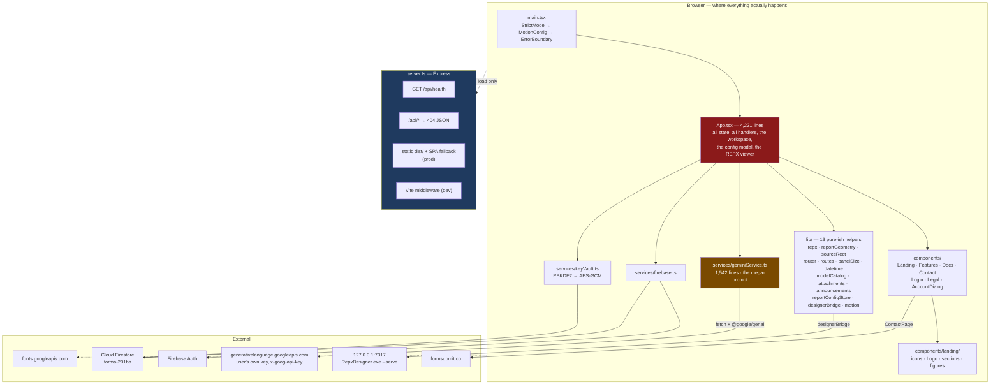
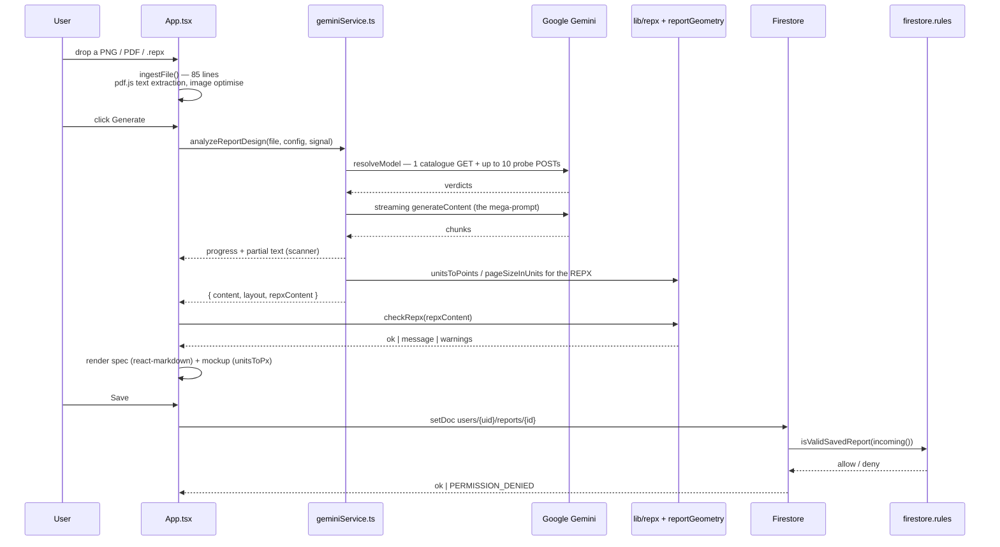

# Phase 2 — Architecture & Code Health

> **Status: superseded in part.** This file records the repository as found on 2026-08-27, *before*
> any fix. Seven roadmap items have since landed and 11 findings are closed — see
> [`07-implementation.md`](07-implementation.md) for current counts and finding status. This file is
> deliberately left unedited as the baseline.

The architecture **as built**, derived from the import graph and the files themselves — not from
the documentation, though the documentation turned out to describe it accurately.

---

## 1. The real architecture

**The one thing to take from that diagram: the server is not on any data path.** It hands over
`index.html` and a bundle and is never spoken to again. Every arrow that carries user data goes
from the browser to a third party directly. This is deliberate and documented — it is the
correction to the key-leak incident — but it means the usual "backend audit" questions have no
subject here, and the security boundary that matters is `firestore.rules`, not any middleware.

### Request lifecycle for a typical write — saving a report

Note what has **no** server hop and therefore no server-side validation: everything. The only
validation authority in the entire write path is `firestore.rules`, which is why its 29 tests
matter more than their count suggests.

---

## 2. Layering

**Clean, and better than the file sizes suggest.** The import graph was built for every
non-test file under `src/` and checked for upward dependencies:

- No file in `lib/` or `services/` imports `App.tsx` or any component. Not one.
- No circular dependency was found; the graph is a DAG rooted at `main.tsx`.
- Fan-out: `App.tsx` 25, then `LandingPage.tsx` 10, then a long tail of 2–6.
- Fan-in: `landing/icons` 11, `Logo` 9, `lib/motion` 7, `SiteHeader`/`SiteFooter`/`SheetRuler` 5.

The one inversion is type-only: `src/lib/sourceRect.ts:10` imports `ReportElement` and `SourceRect`
from `../services/geminiService`, so a `lib/` module names a `services/` type. It is erased at
compile time and carries no runtime edge, but it does mean `sourceRect.ts` cannot be understood
without opening a 1,542-line service. Moving those two interfaces into `lib/` would invert the
dependency the right way round. Recorded as ARC-005.

**Layering violations of the classic kind — data access in a view, business logic in a route — do
not apply, because there are no layers to bypass.** `App.tsx` *is* the controller, the service
coordinator and the view. That is the real finding, and it is ARC-001.

---

## 3. Complexity hotspots, cross-referenced with churn

Churn from Phase 0 (`git log --name-only`, 78 commits).

| File | Lines | Commits | Verdict |
|---|---|---|---|
| `src/App.tsx` | 4,221 | **23** | **Danger.** Biggest, most-changed, zero tests. The whole product's state. |
| `src/services/geminiService.ts` | 1,542 | 3 | **Watch.** Large and central but stable — and it owns the one known open bug. |
| `src/components/ContactPage.tsx` | 787 | 11 | High churn for a static page. Carries the FormSubmit call (INV-001). |
| `src/workspace.css` | 1,652 | 5 | Large but CSS; risk is visual regression, which nothing tests. |
| `src/components/DocsPage.tsx` | 1,001 | 10 | Content-heavy, changes with the product. Low risk. |
| `src/components/FeaturesPage.tsx` | 1,046 | 3 | Large, stable, low risk. |
| `src/index.css` | 926 | 9 | Token layer. A change here reaches every page and nothing tests it. |

**Longest functions in `App.tsx`** (brace-depth walk, top-level declarations):

| Lines | Start | Function |
|---|---|---|
| **216** | 2609 | `handleGenerate` |
| **130** | 2432 | `handleResume` |
| 102 | 547 | `RepxViewer` |
| 85 | 336 | `ingestFile` |
| 71 | 2216 | `handleSaveReport` |
| 58 | 813 | `MockupTable` |
| 55 | 252 | `toUnits` |
| 47 | 873 | `MockupChart` |
| 46 | 450 | `optimizeImageDataUrl` |
| 38 | 2930 | `openInDesigner` |

`handleGenerate` at 216 lines and `handleResume` at 130 are the two that matter: they are the
generation flow, they are the most-changed part of the most-changed file, and between them they
own progress, cancellation, error classification and the streaming update loop.

**Hook density in `App.tsx`:** 30 `useState`, 22 `useEffect`, 11 `useCallback`, 9 `useMemo`,
3 `useRef`. Thirty independent pieces of `useState` in one file is the structural reason the
file cannot be render-tested: there is no seam to inject a state at.

---

## 4. Consistency

**Competing patterns are rare, which is unusual at this size.** Searched for the classic ones:

| Concern | Findings |
|---|---|
| HTTP | One way: `fetch`. Five call sites, no axios, no wrapper, no second convention. |
| Async style | `async/await` throughout. No `.then()` chains outside `void`-style fire-and-forget. |
| Error types | One custom error (`MissingApiKeyError`, `geminiService.ts:209`); everything else is `Error` plus a classified message. Consistent. |
| Naming | `handleX` for event handlers, `useX` for hooks, `xFor(y)` for pure lookups. Consistent across `lib/`. |
| Styling | Two scopes by design: `wb-` classes in `workspace.css`, `.landing` tokens in `index.css`. Documented in `styling.md`. Not a competing pattern — a deliberate split. |
| Markdown rendering | One way: `react-markdown` + `remark-gfm`, one call site (`App.tsx:3807`). |

The only genuine inconsistency found is in outbound-call hygiene, and it is a bug rather than a
style question — see REL-001/REL-002 in Phase 5.

---

## 5. Type safety

- **`strict` is off.** So are `noImplicitAny`, `strictNullChecks`, `noUncheckedIndexedAccess`,
  `noUnusedLocals` and `noUnusedParameters`. `tsconfig.json` sets 12 options and none of them is a
  strictness flag.
- `npm run lint` (`tsc --noEmit`) exits 0, and so does the stricter sweep with
  `--noUnusedLocals --noUnusedParameters`. So there is no dead-symbol debt.
- What `strict` would cost is **unmeasured** and I did not measure it — running `tsc --strict`
  would tell you in 20 seconds, and it is the single highest-value 20 seconds available in this
  codebase. Recorded as ARC-004 with that as the recommendation rather than a guess at the number.

---

## 6. Dead code, duplication, TODOs

- **Dead code: none found.** The `--noUnusedLocals --noUnusedParameters` sweep is clean, and
  Phase 0's unused-export check found nothing orphaned. `_not_required/` is the project's honest
  parking lot rather than dead code left in place, and it is tracked so a grep reaches it.
- **`routesWithoutABranch()` returns `[]`** — verified by running it. The repo has a function
  whose entire job is to assert a list stays empty, and it is empty.
- **TODO/FIXME/HACK/XXX inventory: none.** No occurrences in `src/`. In an 18-day-old codebase
  that is unremarkable, but it is worth recording that there is no deferred-work backlog hiding in
  comments — the deferred work is written down in `docs/notes/` instead, which is the better place.
- **Duplication:** the marketing pages share chrome properly (`SiteHeader`/`SiteFooter`/`MobileNav`
  have fan-in 5 each). The mockup renderers (`MockupTable`, `MockupChart`) are separate on purpose.
  No copy-paste blocks of consequence were found.

---

## 7. State of the codebase — an honest assessment

### What is genuinely good, and should be protected

1. **The documentation is load-bearing and accurate.** Every claim I could mechanically check
   held: the per-file test counts to the digit, the Node-range subtlety about 21/23, the
   `firestoreDatabaseId` match, the 11-hit mojibake exception, the `%VITE_*%` explanation, the
   `/api/*` guard's stated purpose. Two documents were off by a small amount (RUN-003, RUN-005) and
   nothing was wrong in a way that would mislead. This is rare and it is the project's biggest
   asset — it is why an audit could get this far without a working credential.
2. **`firestore.rules` is the best-engineered file in the repo.** `hasOnly` **and** `hasAll` on
   both blueprints, per-operation splits with a written reason (`:59-69` records a real incident
   where a combined `read, write` rule dereferenced a null `request.resource` and silently broke
   key restore), a bounded timestamp so a client cannot pin a report to the top of the list, an
   iteration-count floor so a tampered client cannot weaken the KDF, and no `list` on the vault.
3. **The key architecture is correct and provably so.** No env read, `envPrefix` allowlist, no
   server route, `sessionStorage` only, a `localStorage` migration that *deletes* the old plaintext
   entry, and PBKDF2-SHA256 at 310,000 iterations into AES-GCM-256 with a per-record 16-byte salt
   and 12-byte IV from `crypto.getRandomValues`. This is textbook.
4. **The pure-helper extraction pattern works and is already established.** `repx`, `sourceRect`,
   `routes`, `reportGeometry`, `datetime`, `modelCatalog`, `panelSize`, `attachments`,
   `announcements`, `reportConfigStore`, `designerBridge` were all pulled out of `App.tsx`
   specifically so a test could reach them. That is exactly the right response to the god-file
   problem, and it is already in motion.
5. **`reportGeometry.ts` is a model of how to handle a silent-failure class.** Four coordinate
   systems, one file, every constant explained, and the one that would look right and be 1.6%
   wrong forever (250 vs 254) called out by name.
6. **No `dangerouslySetInnerHTML` anywhere, and `react-markdown` without `rehype-raw`.** The XSS
   surface on model-generated content — the obvious hole in an app like this — is closed by
   construction rather than by sanitising.

### Grades

| Area | Grade | Justification |
|---|---|---|
| Documentation | **A** | Accurate to the digit where checkable. The router pattern in `CLAUDE.md` genuinely works. Docked only for the small drifts in RUN-003/RUN-005/INV-008. |
| Security design | **A−** | The key architecture and the rules are excellent. Docked for zero HTTP security headers and the privacy-statement contradiction (INV-001). |
| Data / rules | **A−** | See above. Docked for the `Document` and `Tabloid` silent fallbacks reaching data shape indirectly. |
| Test quality | **A** | Every test asserts; zero skipped, zero `.only`, zero snapshots, zero sleeps, zero unseeded randomness, one file using mocks and legitimately. See Phase 3. |
| Test **coverage** | **D** | Excellent tests over ~15% of the code. Nothing touches `App.tsx`, no component test, no render test, no coverage tooling installed. |
| Architecture | **C+** | Layering is clean and there are no cycles, but there is effectively one layer: a 4,221-line file holding the whole application. |
| Code quality | **B** | Consistent patterns, no dead code, no TODO debt, good naming. Docked for two 130–216-line functions and 30 `useState` in one file. |
| Type safety | **C** | Compiles clean, but with every strictness flag off, which makes the clean exit much weaker evidence than it looks. |
| Reliability | **C** | Good error handling by count (69 catch blocks, one log-and-continue and it is deliberate). Docked for two outbound calls with no timeout. |
| Performance | **C−** | One 1.99 MB chunk, no code splitting, marketing pages carrying Firebase and pdf.js. |
| Observability | **F** | No logging framework, no metrics, no tracing, no error reporting. `console.*` only. Nothing would tell anyone this broke. |
| DX | **B+** | Five documented checks, all of which pass, all of which are fast. Docked entirely for having no CI to run them. |
| UX / A11y | **Not graded** | Assessed statically only in Phase 5; no automated scan and no keyboard pass was run. |

**Overall: this is a well-reasoned codebase with one structural problem and one process gap.**
The structural problem is `App.tsx`. The process gap is that nothing runs the checks automatically.
Neither is a crisis; both compound.

---

## Findings

---

**ID:** ARC-001
**Title:** The application has one layer — `App.tsx` is controller, coordinator and view at 4,221 lines
**Severity:** P1
**Confidence:** High
**Location:** `src/App.tsx`
**Evidence:** 4,221 lines. 30 `useState`, 22 `useEffect`, 11 `useCallback`, 9 `useMemo`. Fan-out of
25 imports, more than double the next file. Two functions over 130 lines (`handleGenerate` 216,
`handleResume` 130). Holds 10 of the app's 13 event registrations, the auth subscription, the route
applier, the delegated link interceptor and three `setInterval` progress drivers. Touched by 23 of
78 commits. No test reaches it.
**Why it matters:** This is the same object as INV-002 seen from the architecture side, and the
architectural framing is what makes it actionable: the problem is not the line count, it is that
there is no seam. Thirty independent `useState` calls in one component mean no state can be set
from outside, so no render test can be written without first extracting something. Every feature
change lands here, and every one of them is verified by a human looking at a page.
**Repro:** n/a — structural.
**Recommendation:** Keep doing what the repo is already doing, but deliberately and in priority
order. `handleGenerate` is the right next target: extract the progress/cancellation state machine
and the error classification into `lib/` as pure functions over an explicit state object, leaving
`App.tsx` to wire them to React. That single extraction covers the most-changed code in the
most-changed file and is testable the same way `panelSize` and `reportConfigStore` already are.
Phase 3 ranks the rest.
**Effort:** L overall; the first extraction is M
**Fix risk:** High as one refactor, low as a sequence. Do not attempt a general decomposition —
there are no tests to catch a regression, and the visual result is the only oracle.

---

**ID:** ARC-002
**Title:** `handleGenerate` (216 lines) is the highest-risk function in the codebase
**Severity:** P2
**Confidence:** High
**Location:** `src/App.tsx:2609-2824`
**Evidence:** 216 lines, the longest function in the project by 66%. Sits inside the file with the
highest churn. Owns the generation flow end to end: model resolution, streaming, progress ticks
(`setInterval` at `:2717`), cancellation, error classification and result commit. Untested.
`handleResume` at `:2432` (130 lines) is a partial duplicate of the same flow.
**Why it matters:** The single most valuable path in the product runs through here, its behaviour
under failure is the thing users will actually hit (429s, 503s, truncation, cancellation mid-stream),
and every one of those branches is verified only by someone reproducing it by hand with a real key
— which is precisely what nobody can do routinely, since it costs a real request each time.
**Repro:** Read `App.tsx:2609-2824`.
**Recommendation:** Extract the state machine, not the I/O. A pure reducer over
`{phase, progress, error, partial}` with the network call injected would make every failure branch
testable with no key and no network, which is the only way these paths will ever be covered. The
`handleResume` overlap should collapse into it rather than being extracted separately.
**Effort:** M
**Fix risk:** Moderate — this is the flow that must not break. Do it with the extracted reducer
tested first and the wiring changed second.

---

**ID:** ARC-003
**Title:** Observability is `console.*` and nothing else
**Severity:** P2
**Confidence:** High
**Location:** whole codebase — no logging, metrics, tracing or error-reporting dependency exists
**Evidence:** `package.json` has no logging, APM, or error-reporting package. The only diagnostics
are `console.log` / `.warn` / `.error` / `.debug` calls, plus the `ErrorBoundary` at
`src/main.tsx:18-20`, which does `console.error` and renders a fallback. `server.ts` logs one line
at startup. There is no health check beyond `/api/health` returning a constant, no request id, no
correlation id, no client error reporting.
**Why it matters:** The pack asks: *"if this broke at 3am, what would tell us, and could we
diagnose it from what we have?"* The honest answer is **nothing would tell you, and no**. A user
whose generation fails sees a classified message; nobody else learns it happened. For a
pre-launch, zero-traffic project that is a defensible trade — but it is the area that must be
closed *before* any public deployment, not after, because the failures that matter here (model
truncation, a retired model id, a rules change denying writes) are all silent and all user-visible.
**Repro:** `git grep -l "sentry\|datadog\|opentelemetry\|pino\|winston"` → no matches.
**Recommendation:** For this stage, one thing: a client-side error reporter behind an env flag,
wired into the existing `ErrorBoundary` and the `catch` in `handleGenerate`. Metrics and tracing
are premature for a browser-only app with no server. Revisit if generation ever moves server-side
— which `docs/PRD.md` §6 says explicitly it will not.
**Effort:** M
**Fix risk:** Low, but note it is the one change that would send data somewhere new — which
interacts directly with the privacy statement in INV-001. Do that fix first.

---

**ID:** ARC-004
**Title:** `tsconfig.json` enables no strictness flags, so a clean `tsc` proves much less than it appears to
**Severity:** P2
**Confidence:** High
**Location:** `tsconfig.json:2-25`
**Evidence:** Twelve `compilerOptions` are set; none is `strict`, `noImplicitAny`,
`strictNullChecks`, `strictFunctionTypes`, `noUncheckedIndexedAccess`, `noUnusedLocals` or
`noUnusedParameters`. `npm run lint` — the project's only linter — is `tsc --noEmit` against this.
**Why it matters:** `npm run lint` exiting 0 is the check most likely to be treated as "the code is
fine", and with `strictNullChecks` off it cannot see the single most common runtime error class in
a TypeScript app. This is documented in `CLAUDE.md`, so it is known — but the check still runs,
still passes, and still reads as a green light.
**Repro:** `npx tsc --noEmit --strict` and read the count. I did not run it, deliberately: the
number is only useful to you if it is the number *you* then act on, and quoting a figure I
gathered and did not fix would invite treating it as settled.
**Recommendation:** Run `--strict` once to size the debt. If the count is small, turn it on. If it
is large, turn on `strictNullChecks` alone first — it is the flag that buys most of the value — and
consider `noUncheckedIndexedAccess` later. Either way the flag belongs in `tsconfig.json` so
`npm run lint` enforces it, not in a one-off command.
**Effort:** S to measure; M–L to fix depending on what it says
**Fix risk:** Low per fix, but a large diff touching many files at once is exactly the kind of
change with no test coverage behind it. Enable one flag per commit.

---

**ID:** ARC-005
**Title:** `lib/sourceRect.ts` imports its types from `services/`, inverting the dependency direction
**Severity:** P3
**Confidence:** High
**Location:** `src/lib/sourceRect.ts:10`
**Evidence:** `import type { ReportElement, SourceRect } from '../services/geminiService';` — the
only upward reference from `lib/` in the whole graph. It is `import type`, so it is erased at
compile time and creates no runtime edge or cycle.
**Why it matters:** Small, but it means the one file in `lib/` whose whole purpose is to be
independently testable cannot be read without opening a 1,542-line service to find two interface
declarations. It also quietly establishes the wrong precedent for the next helper extracted out of
`geminiService.ts`.
**Repro:** Read the import graph; `lib/` has exactly one edge pointing at `services/`.
**Recommendation:** Move `ReportElement` and `SourceRect` into `src/lib/` (a `reportTypes.ts`, or
alongside `reportGeometry.ts` which already owns the geometry vocabulary) and have
`geminiService.ts` import them downward like everything else.
**Effort:** S
**Fix risk:** None — type-only move, caught immediately by `tsc`.
